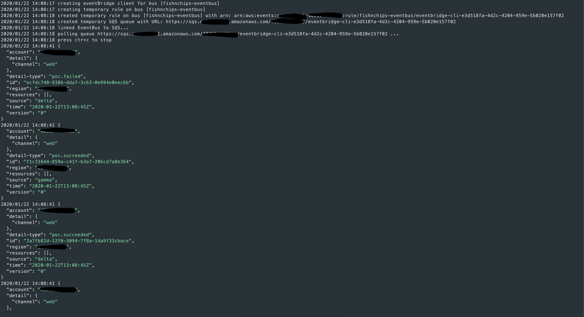
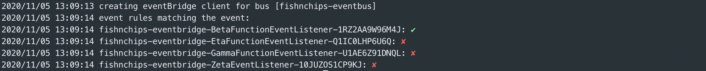

#  eventbridge-cli
[](https://github.com/spezam/eventbridge-cli/releases/latest)


Amazon EventBridge is a serverless event bus that makes it easy to connect applications together using data from your own applications, integrated Software-as-a-Service (SaaS) applications, and AWS services.

Eventbridge-cli is a tool to listen to an EventBus events. Useful for debugging, event pattern testing, CI pipelines integration.
```
EventBus --> EventBrige Rule --> SQS <-- poller
```

Features:
- Listen to Event Bus messages
- Filter messages by event pattern
- Read event pattern from cli, file or SAM template
- Authentication via profile or env variables (AWS_ACCESS_KEY_ID, AWS_SECRET_ACCESS_KEY)
- Pretty JSON output
- CI mode
- Dry event test
- ...



### Install from releases binary:
```
wget https://github.com/spezam/eventbridge-cli/releases/download/<version>/eventbridge-cli_<version>_darwin_amd64.tar.gz
tar xvfz eventbridge-cli_<version>_darwin_amd64.tar.gz
mv eventbridge-cli /somewhere/in/PATH
```
### with go install (installed in $GOBIN)
```
GO111MODULE=on go install github.com/spezam/eventbridge-cli
```
### or build from source:
```
git clone https://github.com/spezam/eventbridge-cli.git
cd eventbridge-cli
go build
```

## Standard mode
### Flags:
```
NAME:
   eventbridge-cli - AWS EventBridge cli

USAGE:
   eventbridge [global options] command [command options] [arguments...]

VERSION:
   1.0.0

AUTHOR:
   matteo ridolfi

COMMANDS:
   ci       AWS EventBridge cli - CI mode
   help, h  Shows a list of commands or help for one command

GLOBAL OPTIONS:
   --profile value, -p value       AWS profile (default: "default") [$AWS_PROFILE]
   --region value, -r value        AWS region [$AWS_DEFAULT_REGION]
   --eventbusname value, -b value  EventBridge Bus Name (default: "default")
   --eventpattern value, -e value  EventBridge event pattern. Can be prefixed by 'file://' or 'sam://' (default: "{\"source\": [{\"anything-but\": [\"eventbridge-cli\"]}]}")
   --prettyjson, -j                Pretty JSON output (default: false)
   --help, -h                      show help (default: false)
   --version, -v                   print the version (default: false)
```

### Usage
Authenticate via environment variable:
```sh
AWS_PROFILE=myawsprofile eventbridge-cli
AWS_DEFAULT_REGION=eu-north-1 AWS_ACCESS_KEY_ID=zzZZ AWS_SECRET_ACCESS_KEY=abbC eventbridge-cli
```

Authenticate via cli flags:
```sh
eventbridge-cli -p myawsprofile
eventbridge-cli -p myawsprofile -r eu-north-1
```

Event pattern can be specified directly in the cli `-e '{}'`, using a JSON file `-e file://...` or from a SAM template `-e sam://<template_file>/<serverless_function_name>`:
```sh
eventbridge-cli -p myawsprofile -j \
	-b fishnchips-eventbus \
	-e '{"source":["gamma"],"detail":{"channel":["web"]}}'

eventbridge-cli -p myawsprofile -j \
	-b fishnchips-eventbus \
	-e file://testdata/eventpattern.json

eventbridge-cli -p myawsprofile -j \
	-b fishnchips-eventbus \
	-e sam://testdata/template.yaml/BetaFunction
```


## CI mode
CI mode can be used to perform integration testing in an automated way.

Given an event pattern (*global* flag `-e`) and an input event (*ci* flag `-i`), verifies the message goes through the event bus within timeout (*ci* flag `-t`).

Note: global flags are position sensitive and can't be used under 'ci' command. For example:
```sh
eventbridge-cli -j ci -t 20
```

### Flags:
```
NAME:
   eventbridge-cli ci - AWS EventBridge cli - CI mode

USAGE:
   eventbridge-cli ci [command options] [arguments...]

DESCRIPTION:
   run eventbridge-cli in CI mode

OPTIONS:
   --timeout value, -t value  CI timeout in seconds (default: 12)
   --inputevent value, -i value  Input event. Can be omitted if coming from other sources or prefixed by 'file://'
   --help, -h                 show help (default: false)
```

### Usage
Event pattern and input event from cli:
```sh
eventbridge-cli -p myawsprofile -j \
   -e '{"source": ["beta"]}' \
   ci -i '{"source":"beta", "detail":"{\"channel\":\"web\"}", "detail-type": "poc"}'
```

Use the `-t` flag to specify timeout:
```sh
eventbridge-cli -p myawsprofile -j \
   -e '{"source": ["beta"]}' \
   ci -i '{"source":"beta", "detail":"{\"channel\":\"web\"}", "detail-type": "poc"}' \
   -t 20
```

Event pattern and input event from file:
```sh
eventbridge-cli -p myawsprofile -j \
   -e file://testdata/eventpattern.json \
   ci -i file://testdata/event_ci_success.json

# failing CI
eventbridge-cli -p myawsprofile -j \
   -e file://testdata/eventpattern.json \
   ci -i file://testdata/event_ci_fail.json
```

Event pattern from SAM template, BetaFunction lambda function:
```sh
eventbridge-cli -p myawsprofile -j \
   -e sam://testdata/template.yaml/BetaFunction \
   ci -i file://testdata/event_ci_success.json
```

Listen to events from any other source (lambda, aws cli, sam local, ...)
```sh
eventbridge-cli -p myawsprofile -j \
   -e file://testdata/eventpattern.json \
   ci
```

## Test Event Rule
Test event payloads against deployed event rules on a specific eventbus.




Given an optional bus (*global* flag `-b`) an event rule (*test-event* flag `-e`) and an input event (*test-event* flag `-i`), verifies the payload will match the rule.
Rule is treated as prefix, so can be a subset of the rule name (ie. `-e fish` will test all rules starting with `fish`)

Note: global flags are position sensitive and can't be used under 'test-event' command. For example:
```sh
eventbridge-cli -b somebus test-event
```

### Flags:
```
NAME:
   eventbridge-cli test-event - AWS EventBridge test-event

USAGE:
   eventbridge-cli test-event [command options] [arguments...]

DESCRIPTION:
   run eventbridge-cli to test an event against a deployed event pattern

OPTIONS:
   --eventrule value, -e value   EventBridge rule name. Can be a prefix
   --inputevent value, -i value  Input event. Can be prefixed by 'file://' or omitted if coming from other sources
   --help, -h                    show help (default: false)
```

### Usage
```sh
eventbridge-cli -p myawsprofile -b fishnchips-eventbus \
   test-event -i file://testdata/event.json -e fishnch

eventbridge-cli -p myawsprofile -b fishnchips-eventbus \
   test-event \
   	-i file://testdata/event.json \
   	-e fishnchips-eventbridge-BetaFunctionEventListener

eventbridge-cli -p myawsprofile -b fishnchips-eventbus \
   test-event \
   	-i '{"version":"0", "id": "cwe-test", "account": "123456789012", "region": "eu-north-1", "time": "2017-04-11T20:11:04Z", "source": ["beta"], "detail": {"channel": ["web"]}, "detail-type": ["poc.succeeded"]}' \
   	-e fishnchips-eventbridge-BetaFunctionEventListener
```


### Content-based Filtering with Event Patterns reference:
https://docs.aws.amazon.com/eventbridge/latest/userguide/content-filtering-with-event-patterns.html

Here is a summary of all the comparison operators available in EventBridge:

| Comparison | Example | Rule syntax  |
| ------------ |------------------ | --------------------|
| Null | UserID is null | "UserID": [ null ] |
| Empty | LastName is empty | "LastName": [""] |
| Equals | Name is "Alice" | "Name": [ "Alice" ] |
| And | Location is "New York" and Day is "Monday" | "Location": [ "New York" ], "Day": [ "Monday" ] |
| Or | PaymentType is "Credit" or "Debit" | "PaymentType": [ "Credit", "Debit" ] |
| Not | Weather is anything but "Raining" | "Weather": [{ "anything-but": [ "Raining" ] }] |
| Numeric (equals) | Price is 100 | "Price": [{ "numeric": [ "=", 100 ] }] |
| Numeric (range) | Price is more than 10, and less than or equal to 20 | "Price": [{ "numeric": [ ">", 10, "<=", 20 ] }] |
| Exists | ProductName exists | "ProductName": [{ "exists": true }] |
| Does not exist | ProductName does not exist | "ProductName": [{ "exists": false }] |
| Begins with | Region is in the US | "Region": [{ "prefix": "us-" }] |


